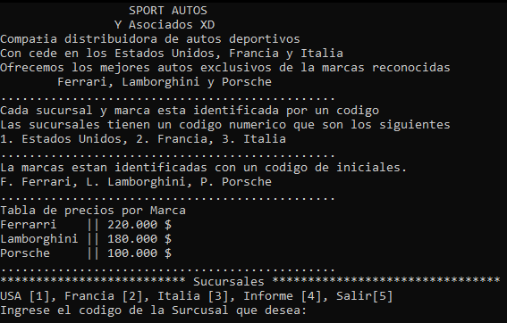
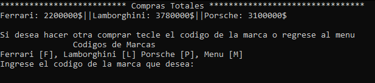
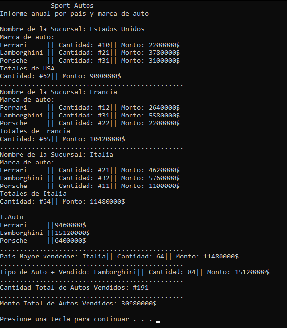

# Sport Autos Project en C++

## Descripción del Proyecto 🚗  
**Sport Autos Project** es una aplicación en **C++** diseñada para mostrar información detallada sobre una empresa ficticia distribuidora de autos deportivos. El programa despliega en pantalla datos como:  
- **Sucursales** (USA, Francia, Italia).  
- **Marcas disponibles** (Ferrari, Lamborghini, Porsche).  
- **Precios** y un informe final con estadísticas de ventas.  

---

## Funcionalidades 🔧  
1. **Estructura en forma de menú**:  
   - **Sucursales**:  
      - USA  
      - Francia  
      - Italia  
   - **Marcas por cada sucursal**:  
      - Ferrari  
      - Lamborghini  
      - Porsche  
   - **Informe final**  
   - **Salir del Programa**  

2. **Salidas del programa**:  
   - **Tabla de precios**:  
      - Desglose de precios de venta por marca y sucursal.  
   - **Informe Final**:  
      - Tablas de cada sucursal con cantidades y montos.  
      - País que más vendió.  
      - Marca más vendida.  
      - Cantidad total de autos vendidos.  
      - Monto total de autos vendidos.  

3. **Estructura modular con librerías**:  
   - `Texto.h`: Encabezado para la presentación del programa.  
   - `Datos.h`: Gestión de datos de sucursales y marcas.  
   - `Salida.h`: Generación de salidas e informes finales.  

---

## Capturas de Pantalla 📸  

### **Presentación del programa**  

### **Menú de Sucursal USA**  

### **Informe Final**  

---

## Cómo Ejecutar el Proyecto ▶️ 

1. **Descargar Archivo ZIP del repositorio**
2. **Ejecutar el archivo main.cpp**

    - Puede ejecutarlo mediente VS.code
    - Puede intalar Dev-Cpp 5.11 TDM-GCC 4.9.2 Setup.exe para ejecutarlo
